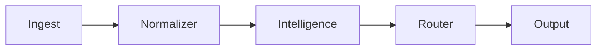

# Platform Architecture

DigitalDamage operates on a modular intelligence core with isolated subsystems.
The platform is engineered for resilience, observability, and rapid adaptation.

## Core Tenets
1. **Isolation-first design:** No subsystem shares memory or execution context.
2. **Stateless routing:** Every request is normalized before intelligence handling.
3. **Deterministic auditability:** Every flow is logged, indexed, and replayable.
4. **Adaptive intelligence core:** Learns from outcomes and reshapes preferred pathways.

## High-Level Diagram

